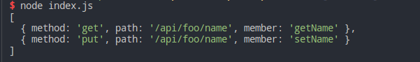
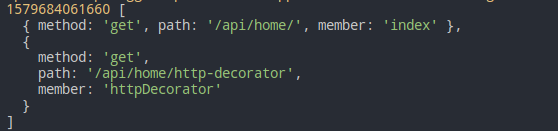

# http-decorators

This project is a typescript library. It will provide some common HTTP method decorators, such as `@Control()`, `@Get()`, `@post()`, `@Delete()`, `@Put()`. For details, please refer to the declaration file. We can use these decorators to combine routes as gracefully as a [nestjs](https://github.com/nestjs/nest).

## Install

```shell
npm i http-decorators
```

## Usage

```typescript
import { Control, HttpDecrator, Get, Put } from 'http-decorators';

@Control('foo')
class Foo {
  private name: string;

  @Get('name')
  getName() {
    return this.name;
  }

  @Put('name')
  setName(_name: string) {
    this.name = _name;
  }
}

const httpDecrator = new HttpDecrator(Foo, { prefix: '/api' });

const routerArr = httpDecrator.getRouters();

console.log(routerArr);
```


#### Use with [Egg](https://eggjs.org/en/tutorials/typescript.html)

```shell
$ mkdir showcase && cd showcase
$ npm init egg --type=ts
$ npm i
```

```typescript
// home.ts
import { Control, Get } from 'http-decorators'
import { Controller } from 'egg';

@Control('home')
export default class HomeController extends Controller {
  @Get()
  public async index() {
    const { ctx } = this;
    ctx.body = await ctx.service.test.sayHi('egg');
  }

  @Get('http-decorator')
  public async httpDecorator() {
    const { ctx } = this;
    ctx.body = await ctx.service.test.sayHi('http-decorator');
  }
}
```

```typescript
// router.ts
import { Application } from 'egg';
import { HttpDecrator } from 'http-decorators'
import { readdirSync } from 'fs';
import * as path from 'path';

export default (app: Application) => {
  const { controller, router } = app;
  const controlDir = path.resolve(__dirname, './controller');
  const fileNameArr = readdirSync(controlDir);

  for (const controlFileName of fileNameArr) {
    const controlFilePath = path.join(controlDir, controlFileName);
    const target = require(controlFilePath).default;
    const {name: nameNoFromat} = path.parse(controlFilePath);
    const httpDecIns = new HttpDecrator(target, { prefix: '/api' });
    const routerArr = httpDecIns.getRouters();

    console.log(Date.now(), routerArr);

    for (const it of routerArr) {
      router[it.method](it.path, controller[nameNoFromat][it.member]);
    }
  }
};
```

```shell
npm run dev
```



## Contributing

Feel free to dive in! [Open an issue](https://github.com/isaaxite/http-decorators/issues) or submit PRs.

## License

[MIT](https://github.com/isaaxite/http-decorators/blob/master/LICENSE) © Richard McRichface


